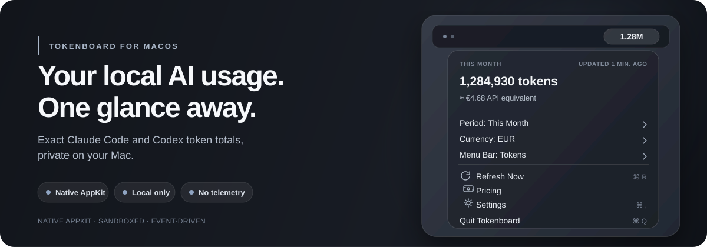

# Tokenboard

A fully native macOS menu-bar app for private, local Claude Code and Codex usage totals.



*Product preview with sample data.*

## Install

Install Tokenboard with Homebrew:

```zsh
brew install --cask typiqally/tokenboard/tokenboard
xattr -dr com.apple.quarantine /Applications/Tokenboard.app
```

Tokenboard is not Apple-notarized. Homebrew downloads and verifies the release; the second command explicitly removes macOS's quarantine attribute from the installed app. It does not grant additional permissions: Tokenboard remains sandboxed and asks you to choose its read-only source folders on first launch.

Upgrade with `brew upgrade --cask tokenboard`. Uninstall with `brew uninstall --cask tokenboard`.

## At a glance

- **Exact local totals.** Tokenboard reduces supported Claude Code and Codex usage logs into durable daily token totals.
- **Honest estimates.** API-equivalent values use public list prices, effective dates, and explicit unpriced coverage. They are estimates, never a bill.
- **Useful ranges.** Read Today, This Week, This Month, This Year, or All Time in tokens or a supported display currency: USD, EUR, JPY, GBP, or CNY.

## Private by construction

- One sandboxed native process with no network entitlement or network requests.
- Explicit, read-only folder grants through the native macOS picker; Tokenboard never guesses a source location.
- No telemetry, analytics, helper, daemon, or XPC service.
- Filesystem-event monitoring rather than a polling timer.
- Content-safe daily aggregates and bookkeeping after ingestion—not prompts, responses, tool content, project metadata, paths below the granted roots, raw session IDs, or per-session totals.

See [PRIVACY.md](PRIVACY.md) for the exact local-data and retention boundary.

## How it works

1. Choose the Claude Code and Codex roots through the native folder picker.
2. Approve the optional historical import for the logs currently available.
3. Read exact totals or API-equivalent estimates from the menu bar while Tokenboard follows future filesystem events.

Committed daily aggregates survive later source-log deletion, and recreating an already imported log does not add it again. Tokenboard cannot recover logs that were unavailable or deleted before the first successful import.

## Understanding API-equivalent value

API-equivalent value estimates what the recorded token categories would cost at standard public API list prices. It is not a bill or a report of Claude or ChatGPT subscription spend. It cannot reproduce provider discounts, credits, batch pricing, negotiated terms, or billing-side classification.

Pricing is effective-dated: Tokenboard applies the rate covering each local usage day instead of repricing old usage at today's rate. Tokens from an unknown model or uncovered date still count but remain visibly unpriced rather than guessed. USD is the canonical pricing currency; other display currencies use the latest locally approved conversion snapshot.

## Updating pricing through your agent

Tokenboard never fetches pricing. In Settings, copy the pricing-update prompt and paste it into Claude Code or Codex. The external agent requests its own network or filesystem access, researches the allowed public sources, reports what it used, and writes a complete local candidate.

Tokenboard validates that candidate locally and applies it atomically. An invalid update leaves the last valid catalog active. Valid updates can append history, correct an entry, or remove an unsupported entry; uncertain coverage remains unpriced.

## Build from source

Requirements:

- macOS 14 Sonoma or newer
- Apple's Swift 6 toolchain and macOS SDK
- No third-party runtime dependencies

```zsh
swift test
Scripts/build-app.sh release
Scripts/verify-entitlements.sh .build/release/Tokenboard.app
open .build/release/Tokenboard.app
```

`build-app.sh` creates a native `Tokenboard.app`. Local builds are ad-hoc signed unless `TOKENBOARD_SIGN_IDENTITY` names a signing identity. Version tags publish an ad-hoc-signed universal app for the Homebrew Cask; Developer ID signing and notarization can be added later without changing the install command.

## Known limits

- Totals depend on usage records present in supported local Claude Code and Codex JSONL formats.
- Logs deleted before the first import are unavailable.
- Unknown formats are skipped and reported; unknown models remain counted but unpriced.
- API-equivalent estimates use standard public API list prices, with the limitations described above.
- Calendar buckets reflect the Mac's local timezone at ingestion; changing timezones later does not rewrite historical buckets.

See [CONTRIBUTING.md](CONTRIBUTING.md) for development, verification, and release checks.

The optional contributor audit is only a bounded comparison of currently discoverable live-source aggregates with the checkpointed main ledger file. It is not proof that Tokenboard's full history is equivalent to the files still on disk, and it cannot account for deleted, replaced, or previously ingested history.
