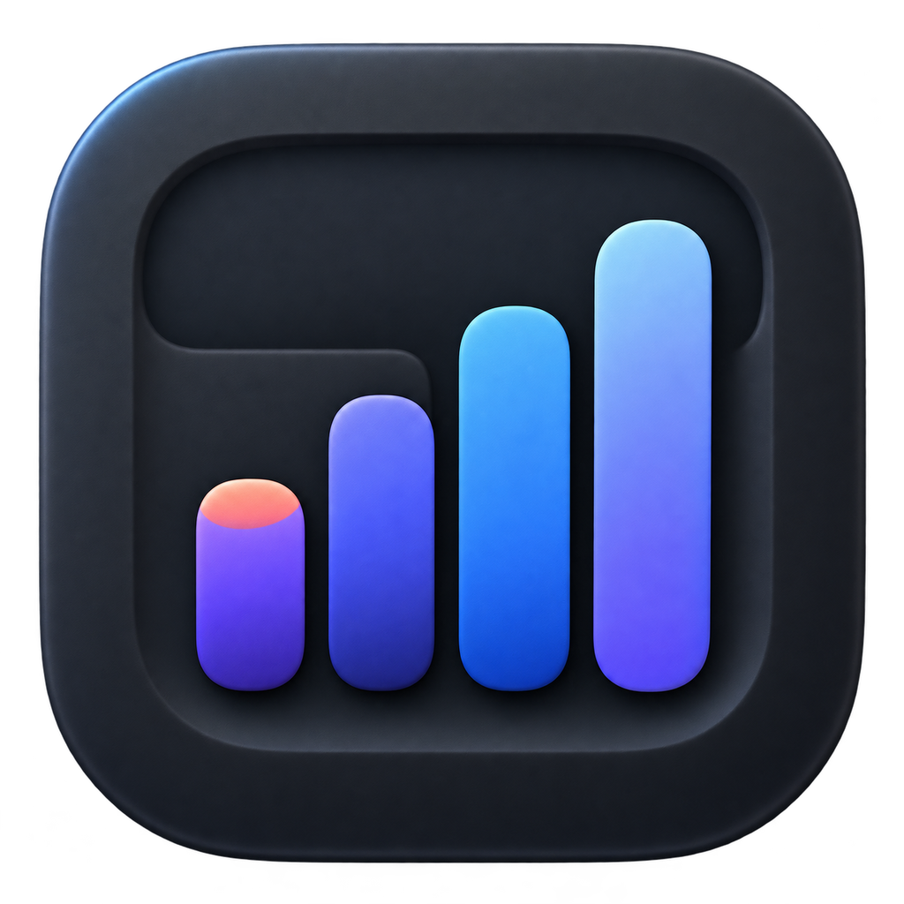
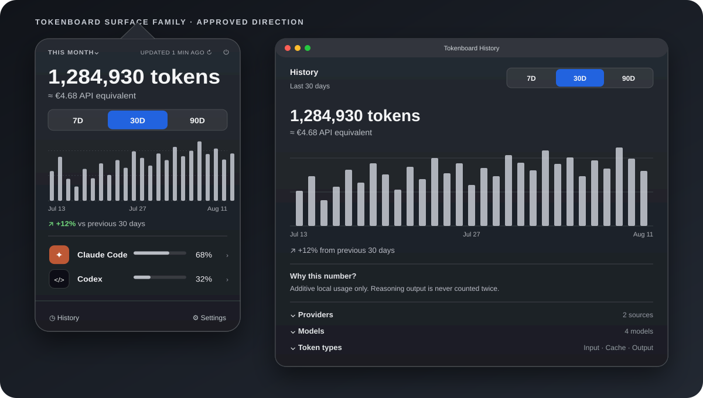

<p align="center">
  
</p>

<h1 align="center">Tokenboard</h1>

<p align="center"><strong>Native, local-only token usage for Claude Code and Codex.</strong></p>

<p align="center">
  See exact totals, recent trends, API-equivalent estimates, provider shares, and private work patterns from the macOS menu bar.
</p>

<p align="center">
  <a href="https://github.com/Typiqally/tokenboard/releases/latest"></a>
  <a href="https://github.com/Typiqally/tokenboard/actions/workflows/ci.yml"></a>
  
  
  
</p>

<p align="center">
  <a href="#install">Install</a> ·
  <a href="#what-you-get">Features</a> ·
  <a href="PRIVACY.md">Privacy</a> ·
  <a href="CONTRIBUTING.md">Contributing</a> ·
  <a href="https://github.com/Typiqally/tokenboard/issues">Issues</a>
</p>


<p align="center"><em>One glance in the menu bar, one click for the complete local picture.</em></p>

## Current release — 0.9.1

Tokenboard 0.9.1 sharply reduces idle energy use. Native filesystem events are now the fast path, five-second metadata reconciliation is bounded to a fair set of 64 recent files, full safety inventories run every 15 minutes, and bursty ingestion refreshes are coalesced. The release also preserves committed aggregates and reconciliation coverage after source-log deletion, and correctly orders work-pattern activity across midnight.

<p align="center">
  <strong><a href="https://github.com/Typiqally/tokenboard/releases/download/v0.9.1/Tokenboard-0.9.1.zip">Download Tokenboard 0.9.1</a></strong>
  ·
  <a href="https://github.com/Typiqally/tokenboard/releases/tag/v0.9.1">Release notes</a>
</p>

The archive contains a universal Apple silicon and Intel app for macOS 14 or newer. SHA-256: `62180f7450a75f227435fd6fe0e74eab7bbf544cf21b030eb4eae9fdf68da7ee`.

## Why Tokenboard

Claude Code and Codex record token usage locally, but neither gives you one durable, shared view of that activity. Tokenboard reads only the folders you choose, reduces supported records to content-safe aggregates, and keeps the result available after old source logs disappear.

There is no account, cloud service, telemetry endpoint, or background helper. The app is one native macOS process, uses filesystem events as its fast path, and reconciles read-only JSONL metadata so silently missed appends still appear.

## What you get

| Surface | What it answers |
| --- | --- |
| **Menu bar** | How many tokens, or how much API-equivalent value, have I used in the selected period? |
| **Popover** | What is the exact total, how is it trending, when am I active, and how is usage split between Claude Code and Codex? |
| **History** | Which providers, models, and token categories produced the total? What are my recurring work patterns? |
| **Companions** | Can today's progress inhabit a quiet visual world without turning usage into a streak or score? |
| **Discord Activity** | Can I optionally share today's compact total and estimated focus time with friends? |

Highlights:

- Exact totals for Today, This Week, This Month, This Year, and All Time.
- Independent `TODAY`, `7D`, `30D`, and `90D` charts with hover, scrub, and click-to-pin values.
- Effective-dated API-equivalent estimates that leave unknown prices visibly unpriced instead of guessing.
- Provider, model, Input, Cache, and Output breakdowns without double-counting reasoning output.
- Local Work Patterns: conservative focus-time estimates, neutral rhythm and AI-interaction observations, focus-block profiles, activity consistency, schedule ranges, and estimate makeup.
- Event-driven updates backed by read-only metadata reconciliation, with an explicit full Refresh action when you want one immediately.
- Optional companion panoramas for Pokémon, Forest, Village, Old School RuneScape, Age of Empires II, Minecraft, Banished, and Frostpunk.
- Optional Discord Rich Presence with a static **View on GitHub** action.

## Install

### Homebrew

Tokenboard requires macOS 14 Sonoma or newer. It is not Apple-notarized yet; Homebrew verifies the downloaded release, and the second command removes quarantine only from the installed Tokenboard app.

```zsh
brew install --cask typiqally/tokenboard/tokenboard
xattr -dr com.apple.quarantine /Applications/Tokenboard.app
open /Applications/Tokenboard.app
```

Upgrade later with `brew upgrade --cask tokenboard`. Uninstall with `brew uninstall --cask tokenboard`.

You can also download the universal app archive from the [latest GitHub release](https://github.com/Typiqally/tokenboard/releases/latest). Verify it against the SHA-256 digest GitHub publishes for the release asset before opening it.

### Ask a coding agent to install it

<details>
<summary>Copy the installation prompt</summary>

```text
Install the latest public release of Tokenboard from
https://github.com/Typiqally/tokenboard.

Prefer the official Homebrew cask typiqally/tokenboard/tokenboard. If Homebrew
is unavailable, download the single app archive from the latest GitHub release,
verify its SHA-256 against the digest GitHub publishes for that release asset,
and place Tokenboard.app in /Applications. Do not build from source. If
Tokenboard is already installed through Homebrew, upgrade it instead of deleting
it manually.

Tokenboard is not Apple-notarized. Remove the quarantine attribute only from
the exact installed path /Applications/Tokenboard.app, then open the app and
confirm the installed version. Do not grant access to any folders for me.

When it opens, tell me to choose my Claude Code and Codex source folders in the
native onboarding screen. Explain that unknown or outdated model prices stay
unpriced until I use Settings > Pricing > Copy Pricing Update Prompt and give
that prompt to an agent. Never invent or guess model prices.
```

</details>

## The native experience



### Popover

The menu-bar value stays deliberately small. Opening it reveals the exact total, API-equivalent estimate, update recency, trend, comparison, Work Patterns preview, and Claude Code/Codex shares.

The standard popover is `350 × 560`. Enabling a companion keeps the complete surface at `350 × 656` and turns the top `350 × 224` into a full-bleed panorama. The native period, refresh, quit, total, and API-value label sit over a dark-to-clear scrim; the chart and breakdown remain on the solid data surface below. Selecting `None` restores the original compact layout exactly.

- The header period controls the headline total.
- The segmented range controls the chart, comparison, Work Patterns preview, and provider shares.
- Hovering or scrubbing shows an exact hour or day; clicking pins the callout.
- Provider rows open History with that provider and range already selected.
- History and Settings remain one click away in the footer.

### History and Work Patterns

History uses the same typography, chart language, range control, and provider identity at working-window scale. Expand providers, models, and token categories, or switch to Work Patterns for hourly and weekday structure.

Focus time is a conservative estimate of AI-assisted work, not continuous time tracking. Tokenboard records provider-only five-minute activity slices when additive usage occurs. Slices up to 15 minutes apart form one focus block; larger gaps start another block. One isolated interaction therefore counts as five minutes, not a full hour. Work without Claude Code or Codex activity is not measured, and earlier token totals remain available even when focus timing does not.

For 7D, 30D, and 90D ranges, Work Patterns presents three stable, neutral observations: recurring local-time rhythm, focus-block shape, and Claude/Codex interaction mix. Sparse history stays visibly in a learning state instead of producing an unstable conclusion. The supporting view includes a focus-time heatmap, 5–10/15–25/30–55/60+ minute block bands, the middle 50% of first and last activity times, and an explicit split between activity-backed five-minute slices and time bridged between interactions. These are descriptive patterns, never productivity or efficiency scores.

### Companion journeys

Companions are optional and visual-only. Each theme is a twelve-stage day driven by the existing `TODAY` total, resets at local midnight, and uses a deterministic local seed so one installation remains coherent across launches. No art or journey state is downloaded at runtime.

Scenes animate only while genuinely visible. Settings thumbnails stay still, and Reduced Motion uses a deliberately composed resting frame rather than freezing an arbitrary animation instant. `None` keeps the original undecorated tool.

## Private by construction

```text
Folders you choose
      ↓ read-only
Local parsers
      ↓ content-safe token aggregates + five-minute activity slices
Local SQLite ledger
      ↓
Menu bar · Popover · History
```

Tokenboard stores token aggregates, provider-only five-minute activity slices, exact content-safe model IDs, price history, opaque salted bookkeeping hashes, the two selected-root bookmarks, and explicit preferences. It does **not** store prompts, responses, tool content, project metadata, paths beneath the granted roots, raw session IDs, or per-session totals.

- No telemetry, analytics, remote API, web view, helper, daemon, or XPC service.
- No source-log edits or deletions.
- Native filesystem events backed by a periodic, read-only comparison of JSONL paths, sizes, and modification dates.
- One unsandboxed process with no privilege entitlements. The unsandboxed boundary exists for Discord's same-user local Unix socket.
- Companions are bundled and stay offline.
- Discord Activity is off by default and requires an exact first-use preview and confirmation.

Read the full [privacy and retention model](PRIVACY.md), including source revocation, local-data deletion, recovery backups, and Discord's narrow payload.

## API-equivalent value

API-equivalent value estimates what recorded token categories would cost at standard public API list prices. It is not a bill and cannot reproduce subscription spend, discounts, credits, batch pricing, or provider-side classification.

Rates are effective-dated, so old usage keeps the price that covered its day. Exact zero means known-free; missing coverage stays unpriced. USD is canonical, while optional display currencies use the latest locally approved conversion snapshot.

Tokenboard never fetches pricing itself. Settings can copy a constrained pricing-update prompt for Claude Code or Codex; the external agent researches approved first-party sources and writes a local candidate. Tokenboard validates and applies that candidate atomically, retaining an auditable price history.

## Discord Activity

Discord sharing is deliberately narrow and disabled by default. When enabled, Tokenboard sends only:

- `Playing Tokenboard`
- today's compact token total
- today's estimated focus duration
- a static **View on GitHub** action

It does not send provider, model, project, path, conversation, cost, timestamps, party data, or secrets. Communication goes only to the running Discord desktop client's same-user local IPC socket. Discord hides Rich Presence buttons from the account publishing the activity, so the GitHub action is visible to other users rather than in your own Current Activity card.

## Build from source

Requirements:

- macOS 14 Sonoma or newer
- Apple Swift 6 toolchain and macOS SDK
- No third-party runtime dependencies

```zsh
git clone https://github.com/Typiqally/tokenboard.git
cd tokenboard
swift test
TOKENBOARD_DISCORD_APPLICATION_ID=1543692689571192862 \
  Scripts/build-app.sh release universal
open .build/release/Tokenboard.app
```

For the complete release-quality gate:

```zsh
swift test
Scripts/benchmark-import.sh
Scripts/verify-asset-rights.sh development
Scripts/test-tooling-contracts.sh
TOKENBOARD_DISCORD_APPLICATION_ID=1543692689571192862 Scripts/build-app.sh release universal
Scripts/verify-entitlements.sh .build/release/Tokenboard.app
Scripts/verify-runtime-resources.sh .build/release/Tokenboard.app
git diff --check
```

The shared public Discord application ID is required only for release builds. The Discord application should have a Rich Presence image asset with the exact key `tokenboard`.

## Repository map

| Path | Purpose |
| --- | --- |
| [`Sources/TokenboardCore`](Sources/TokenboardCore) | Parsing, aggregation, pricing, local SQLite ledger, and filesystem monitoring |
| [`Sources/TokenboardApp`](Sources/TokenboardApp) | Native AppKit/SwiftUI application and presentation logic |
| [`Resources`](Resources) | App metadata, pricing catalog, icon, and bundled companion artwork |
| [`Tests`](Tests) | Core, lifecycle, UI-presentation, migration, privacy, and release-contract coverage |
| [`Scripts`](Scripts) | Building, packaging, asset verification, benchmarks, and runtime gates |
| [`docs/design`](docs/design) | Product visualization used by this README |

## Contributing

Contributions are welcome when they preserve Tokenboard's core boundaries: native macOS behavior, explicit read-only grants, content-free persistence, honest estimates, and low idle resource use.

Start with [CONTRIBUTING.md](CONTRIBUTING.md). It documents the automated gate, synthetic-fixture rules, security constraints, companion asset clearance, and release acceptance process. For product and interface decisions, see [PRODUCT.md](PRODUCT.md) and [DESIGN.md](DESIGN.md).

Found a bug or have a focused proposal? [Open an issue](https://github.com/Typiqally/tokenboard/issues).

## Known limits

- Totals depend on supported Claude Code and Codex local JSONL formats.
- Logs deleted before the first successful import cannot be recovered.
- Unknown formats are skipped and reported; unknown models remain counted but unpriced.
- Calendar buckets use the Mac's local timezone at ingestion and are not rewritten after a timezone change.
- Refresh remains available for an immediate full rescan if a filesystem event is missed.
- Tokenboard is currently ad-hoc signed and not Apple-notarized.
